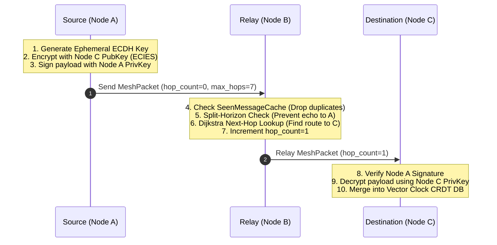

<div align="center">

# ⚡ Nexus Support
### Decentralized, Zero-Internet Emergency Mesh Communication & Geospatial Intelligence

[](https://github.com/deekshudevang/Nexus-Support/actions/workflows/ci.yml)
[](https://github.com/deekshudevang/Nexus-Support/actions/workflows/codeql.yml)
[](https://developer.android.com)
[](https://kotlinlang.org)
[](https://developer.android.com/jetpack/compose)
[](docs/ARCHITECTURE.md)
[](docs/SECURITY_SPEC.md)
[](LICENSE)

<p align="center">
  <b>A production-grade, zero-trust, multi-hop mesh network designed for disaster relief, off-grid operations, and tactical field deployments.</b>
  <br />
  Operates completely independent of cellular towers, satellite uplinks, or centralized servers.
</p>

[Key Features](#-key-features) • [Architecture](#-system-architecture) • [Mesh Protocol](#-mesh-routing-protocol) • [Security](#-cryptographic-security) • [Documentation](#-deep-dive-documentation) • [Getting Started](#-getting-started) • [Testing](#-verification--simulation)

---

</div>

## 📖 Overview

**Nexus Support** turns commodity Android smartphones into autonomous nodes in an ad-hoc, multi-hop mesh network. Using a hybrid combination of **Bluetooth Low Energy (BLE)** and **Wi-Fi Direct** via Google Nearby Connections, devices dynamically discover peers, establish encrypted links, and route emergency messages and GPS coordinates across up to **7 hops**.

When communications infrastructure collapses during natural disasters, search-and-rescue missions, or remote expeditions, Nexus Support provides a resilient lifeline.

```
       [Field Unit A] 
             │ (Hop 1: BLE)
             ▼
       [Relay Node B] 
             │ (Hop 2: Wi-Fi Direct)
             ▼
       [Relay Node C] 
             │ (Hop 3: BLE)
             ▼
     [Command Post D] ──► (Offline Vector Map + SOS Alert)
```

---

## ⚡ Key Features

| Capability | Technical Details |
|---|---|
| **Multi-Hop Routing** | Dynamic Dijkstra shortest-path pathfinding across ad-hoc graphs (up to 7 hops). |
| **Zero-Internet Maps** | 100% offline Mapsforge vector tile engine rendering topo & street maps directly on-device. |
| **High-Precision GPS** | Sub-meter location tracking synchronized via **Vector Clocks & CRDTs** for eventual consistency. |
| **Store & Forward** | Persistent message buffer (48h TTL) delivering packets automatically when disconnected peers rejoin. |
| **Hardware KeyStore** | EC P-256 identity key generation isolated within **StrongBox Keymaster HSM** / TEE enclaves. |
| **End-to-End Encryption** | Direct **AES-256-GCM** sessions + multi-hop **ECIES** (Ephemeral ECDH + HKDF SHA-256). |
| **Tamper Proofing** | ECDSA SHA-256 signatures bound to packet UUIDs with a 24h temporal validity window. |
| **At-Rest Encryption** | Entire Room SQLite database encrypted at rest via **SQLCipher AES-256-CBC**. |
| **Battery Intelligence** | Adaptive scan cycle adjusting discovery intervals based on battery level and movement. |
| **Opportunistic Sync** | Background WorkManager syncing pending telemetry to cloud backends if internet restores. |

---

## 🏗️ System Architecture

Nexus Support is engineered following strict **Clean Architecture** principles, enforcing separation of concerns and high testability:

```mermaid
graph TD
    subgraph UI_Layer [Presentation Layer (:app)]
        UI[Jetpack Compose Screens & Material 3]
        VM[StateFlow ViewModels & Navigation]
        Workers[WorkManager Sync & Maintenance]
        UI --> VM
        VM --> Workers
    end

    subgraph Domain_Layer [Business Domain (:core:domain)]
        Models[Domain Models: MeshPacket, VectorClock, KnownDevice]
        Repos[Repository Interfaces & UseCases]
    end

    subgraph Engine_Layer [Core Engine Modules]
        Mesh[":core:mesh (MeshRouter, Dijkstra, SeenCache, Battery)"]
        Crypto[":core:crypto (KeyStore, ECIES, AES-GCM, Signatures)"]
        Data[":core:data (SQLCipher, Room DAOs, Retrofit)"]
    end

    UI_Layer --> Domain_Layer
    Engine_Layer --> Domain_Layer
    UI_Layer --> Engine_Layer
```

---

## 📡 Mesh Routing Protocol



---

## 🔐 Cryptographic Security

Nexus Support treats every radio link as an insecure medium:

```
┌────────────────────────────────────────────────────────────────────────┐
│                        Wire Packet Security                            │
├──────────────────────────┬─────────────────────────────────────────────┤
│ Identity                 │ NIST P-256 (secp256r1) EC KeyPair           │
│ Hardware Module          │ Android StrongBox HSM / Hardware TEE        │
│ Direct Link Encryption   │ AES-256-GCM (96-bit Nonce, 128-bit Tag)     │
│ Multi-Hop Routing        │ ECIES (Ephemeral ECDH + HKDF-SHA256)        │
│ Replay Defense           │ ECDSA(SHA-256, eventId ∥ peerId ∥ payload)  │
│ Database at Rest         │ SQLCipher AES-256-CBC (KeyStore-derived)    │
│ Production R8 / ProGuard │ Stripped debug logs, minified & obfuscated  │
└──────────────────────────┴─────────────────────────────────────────────┘
```

---

## 📚 Deep-Dive Documentation

Detailed technical design specifications are available in the [`docs/`](docs/) directory:

- 🏛️ [**System Architecture & Submodules**](docs/ARCHITECTURE.md) — Comprehensive breakdown of layers, reactive state flow, and dependency injection.
- 📡 [**Mesh Routing & Protocol Specification**](docs/MESH_PROTOCOL.md) — Wire format, Dijkstra cost heuristics, split-horizon, and Vector Clock CRDT mechanics.
- 🔐 [**Cryptographic Security Specification**](docs/SECURITY_SPEC.md) — Key generation, hardware enclaves, ECIES math, and anti-replay windows.
- 🗺️ [**Offline Maps & GPS Engine**](docs/OFFLINE_MAPS.md) — Mapsforge vector tile pipelines, zero-internet geospatial tracking, and coordinate rendering.

---

## 🚀 Getting Started

### Prerequisites
- **JDK 17+** (e.g., OpenJDK / Eclipse Temurin 17 or 21)
- **Android Studio** (Meerkat, Ladybug, or newer)
- **Physical Devices**: 2 or more Android devices (API 26+) for hardware radio testing (Nearby Connections requires physical Bluetooth/Wi-Fi chips)

### Clone & Build

```bash
# Clone the repository
git clone https://github.com/deekshudevang/Nexus-Support.git
cd Nexus-Support

# Build debug APK
./gradlew assembleDebug

# Build release APK (R8 minification + SQLCipher enabled)
./gradlew assembleRelease
```

---

## 🧪 Verification & Simulation

Nexus Support includes an extensive JVM-based multi-node simulation suite that validates mesh algorithms under stress without needing dozens of physical test devices:

```bash
# Execute the full JVM unit test suite
./gradlew test

# Run the 20-node mesh simulation suite
./gradlew :core:mesh:test --tests "com.meshlink.app.mesh.routing.LargeScaleMeshSimTest"
```

### Simulated Test Scenarios
1. **20-Node Linear Chain** — Validates multi-hop packet propagation across max hop limits.
2. **20-Node Dense Mesh** — Tests `SeenMessageCache` deduplication under dense flooding conditions.
3. **Partition & Reconnect** — Verifies store-and-forward queueing when subgraphs disconnect and rejoin.
4. **Dynamic Node Churn** — Evaluates routing table convergence as nodes continuously drop and reconnect.
5. **Heartbeat Flood Attack** — Proves rate-limiters block Sybil / Sinkhole denial-of-service attempts.
6. **TTL Boundary Wall** — Confirms packets terminate precisely at `maxHops` to prevent endless loops.
7. **Split-Horizon Verification** — Guarantees packets are never bounced back to the receiving link.

---

## 🤝 Contributing

We welcome contributions from the open-source community! Please review [CONTRIBUTING.md](CONTRIBUTING.md) and our [Code of Conduct](CODE_OF_CONDUCT.md) before submitting pull requests.

---

## 📄 License

This project is licensed under the **MIT License** — see the [LICENSE](LICENSE) file for details.
