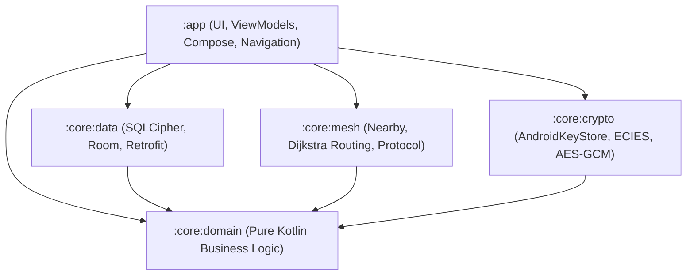

# System Architecture

**Nexus Support** is built on the principles of **Clean Architecture**, **Domain-Driven Design**, and **Zero-Trust Offline Operation**.

---

## 🏛️ High-Level Architectural Layers

The codebase is strictly separated into modular subprojects to ensure unidirectional dependency flow, testability on the JVM, and clear boundaries:



---

## 📦 Module Breakdown

### 1. `:core:domain` (Pure Kotlin Layer)
- **Role**: Heart of the system. Completely decoupled from Android SDK / UI frameworks.
- **Components**:
  - `MeshPacket`, `MeshMessage`, `KnownDevice`, `VectorClock`, `EmergencyContact`
  - Repository interfaces: `DeviceRepository`, `MessageRepository`, `LocationSyncManager`, `NearbyRepository`, `PendingMessageRepository`
- **Benefits**: Can be tested 100% on JVM with zero mocking of Android framework classes.

### 2. `:core:crypto` (Cryptographic Security Layer)
- **Role**: Manages cryptographic identity, key derivation, hardware secure enclaves, and wire encryption.
- **Components**:
  - `KeyManager`: Generates and manages EC P-256 keypairs inside StrongBox / AndroidKeyStore.
  - `EciesService`: Ephemeral ECDH key agreement for secure multi-hop onion routing.
  - `EncryptionService`: Symmetric AES-256-GCM authenticated payload encryption.
  - `HandshakeManager`: Ephemeral session key negotiation during peer discovery.

### 3. `:core:mesh` (Mesh Routing & Transport Layer)
- **Role**: P2P transport abstraction, neighbor discovery, multi-hop routing, loop prevention, and battery-aware scanning.
- **Components**:
  - `MeshRouter`: Core routing logic implementing Dijkstra's shortest path over dynamic link costs.
  - `RoutingTable`: Dynamic routing state with split-horizon route poisoning and neighbor TTL expiry.
  - `SeenMessageCache`: Cryptographic hash sliding window filter to block broadcast storms.
  - `AdaptiveScanController` & `BatteryMonitor`: Battery-level-driven scanning duty cycles.
  - `MeshPacketSerializer`: Protobuf wire serialization.

### 4. `:core:data` (Persistence & Cloud Synchronization)
- **Role**: Encrypted local database, store-and-forward queueing, and opportunistic cloud sync.
- **Components**:
  - `AppDatabase`: Room database backed by **SQLCipher AES-256-CBC**.
  - DAOs: `DeviceDao`, `MessageDao`, `PendingMessageDao`, `LocationEventDao`, `ProcessedEventDao`.
  - `MockMeshBackendService` / `MeshBackendService`: Retrofit REST interface for opportunistic cloud synchronization when internet connectivity returns.

### 5. `:app` (Application & Presentation Layer)
- **Role**: Jetpack Compose UI, Material 3 design system, state holders (ViewModels), background workers.
- **Screens**:
  - `HomeScreen`: Nearby active mesh peers, connection status, quick actions.
  - `ChatScreen`: 1-to-1 encrypted chat and broadcast channels.
  - `MeshMapScreen` & `MapDownloadScreen`: Zero-internet offline vector map with real-time peer positions.
  - `SosScreen`: Emergency broadcast trigger with medical profile attachments.
  - `MedicalProfileScreen`: User-editable health information and emergency contacts.
  - `SettingsScreen`: Radio toggles, battery optimization modes, cryptographic identity inspection.
- **Workers**: `CloudSyncWorker` and `MeshCleanupWorker` managed via AndroidX WorkManager.

---

## 🔄 Reactive Data Flow

```
[User Action] 
     │
     ▼
[ViewModel] (StateFlow / UI State)
     │
     ▼
[Repository] (Domain Interface)
     │
     ├──► [Encrypted Local DB (SQLCipher)] ──► Room Flow ──► UI Update
     │
     └──► [MeshRouter / NearbyTransport] ──► P2P Radio (BLE / Wi-Fi Direct)
```


---
**Last verified:** 2026-09-20 @ HEAD
